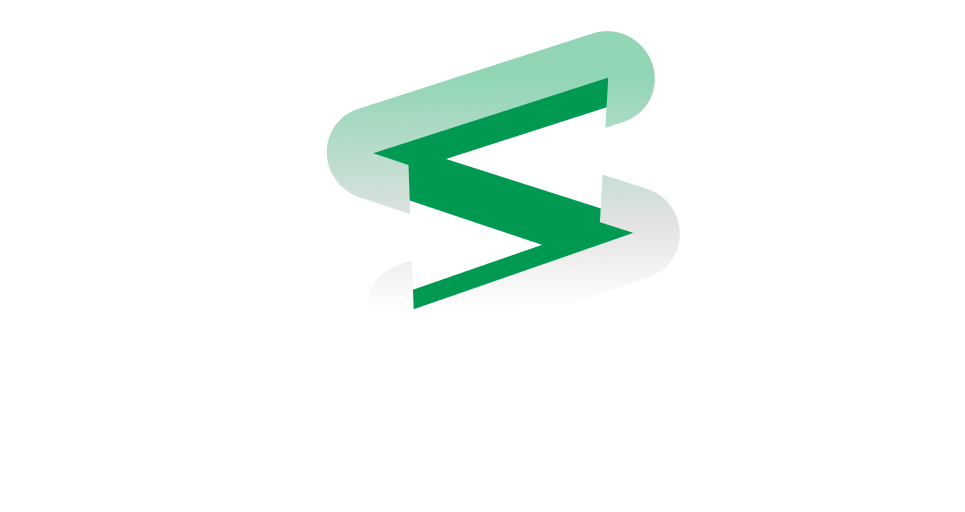

---

## Introduction

**Symbolia** is a lightweight stack-based virtual machine designed to execute user-defined workflows through a concise set of opcodes.  
It enables creating, composing, and running deterministic pipelines with flexibility and simplicity.

---

## Project Goals

- Provide a **deterministic**, **portable**, and **efficient** stack machine execution environment.
- Support **user-defined functions**, **control flow** (loops, conditionals), and basic arithmetic and logical operations.
- Enable complex workflows by composing abstract functions and dynamic invocations.
- Serve as a foundation for higher-level workflow engines, orchestration tools, and distributed job execution.
- Ensure easy integration with other systems via simple data formats and dedicated SDKs.

---

## Final Objective & Architecture

The ultimate goal of Symbolia is to run as a **distributed system on Kubernetes**, leveraging:

- Multiple **replicated pods** running the Symbolia VM, exposing APIs discovered and orchestrated through the **Kubernetes DNS** service.
- **Redis** for fast caching and ephemeral locking mechanisms between pods.
- **Cassandra** for durable, scalable storage of workflow state, results, and metadata.
- Development of a **Standard Library** of reusable opcode functions to simplify workflow creation.

---

### High-Level Architecture Diagram

```mermaid
flowchart TD
    subgraph Kubernetes Cluster
        Pod1[Symbolia Pod Replica 1]
        Pod2[Symbolia Pod Replica 2]
        Pod3[Symbolia Pod Replica 3]
        DNS[CoreDNS - Service Discovery & Job Dispatch]
    end

    Redis[(Redis Cache & Locking)]
    Cassandra[(Cassandra DB)]

    User -->|Submit Workflow Job| API[Symbolia API Endpoint]
    API --> DNS
    DNS -->|Service Discovery| Pod1
    DNS -->|Service Discovery| Pod2
    DNS -->|Service Discovery| Pod3

    Pod1 --> Redis
    Pod2 --> Redis
    Pod3 --> Redis

    Pod1 --> Cassandra
    Pod2 --> Cassandra
    Pod3 --> Cassandra
````

---

### Workflow Execution Flow

```mermaid
sequenceDiagram
    participant User
    participant API
    participant DNS
    participant Pod
    participant Redis
    participant Cassandra

    User->>API: Submit workflow job
    API->>DNS: Discover available pods
    DNS->>Pod: Dispatch job to a pod instance
    Pod->>Redis: Acquire locks / cache state
    Pod->>Pod: Execute workflow instructions (opcodes)
    Pod->>Cassandra: Persist execution state and results
    Pod->>Redis: Release locks / update cache
    Pod->>API: Update job status
    API->>User: Notify job completion
```

---

## Project Structure

* **Opcode Implementations**: individual instruction handlers (add, sub, jump, etc.)
* **Virtual Machine Core**: stack management, instruction dispatch, function invocation.
* **Abstract Function Definitions**: symbolic user function representations.
* **Runtime Environment**: symbol tables, stack frames, and I/O handling.
* **SDKs**: language bindings (Go, Python).
* **CLI Tools**: submission, management, and monitoring of workflows.
* **Observability**: metrics and tracing integrations.
* **Standard Library** *(to be developed)*: reusable opcode functions for common tasks.

---

## Getting Started

Clone the repository, build the VM, and try the sample opcode functions in the examples folder.